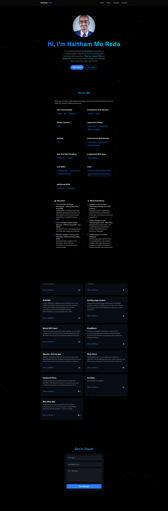

# Haitham's Portfolio

 <!-- Add a screenshot if available -->

A modern, responsive portfolio website showcasing my projects, skills, and professional background.

## Live Demo

👉 [View Live Portfolio](https://portfolio-mhkyu4qp6-haitham-mo-redas-projects.vercel.app/)

## Features

- **Responsive Design**: Works on all device sizes
- **Project Showcase**: Highlighting key projects with descriptions and technologies used
- **Skills Section**: Displaying technical competencies
- **Contact Form**: Easy way for visitors to reach out
- **Dark/Light Mode**: Toggleable theme preference
- **Smooth Animations**: Enhanced user experience with subtle animations

## Technologies Used

- **Frontend**:
  - Vite.js (React framework)
  - Tailwind CSS (styling)
  - Framer Motion (animations)
- **Deployment**:
  - Vercel (hosting)

## Project Structure
