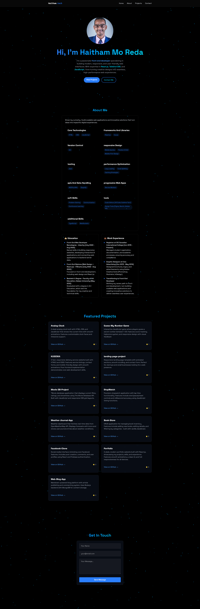

# Haitham's Portfolio

 <!-- Add a screenshot if available -->

A modern, responsive portfolio website showcasing my projects, skills, and professional background.

## Live Demo

👉 [View Live Portfolio](https://portfolio-mhkyu4qp6-haitham-mo-redas-projects.vercel.app/)

## Features

- **Responsive Design**: Works on all device sizes
- **Project Showcase**: Highlighting key projects with descriptions and technologies used
- **Skills Section**: Displaying technical competencies
- **Contact Form**: Easy way for visitors to reach out
- **Smooth Animations**: Enhanced user experience with subtle animations

## Technologies Used

- **Frontend**:
  - Vite.js (React framework)
  - Tailwind CSS (styling)
  - Framer Motion (animations)
- **Deployment**:
  - Vercel (hosting)
- **Packages**:
  - Emailjs
  - Toastify.js

## Project Structure

portfolio/
├── public/ # Static assets
├── src/
│ ├── assets/ # Images
│ │ ├── Pic.jpg # Profile picture
│ │ └── Full-Pic-Portoflio.png # Website screenshot
│ ├── components/ # Reusable components
│ │ ├── LandingScreen.jsx
│ │ ├── MobileMenu.jsx
│ │ ├── Navbar.jsx
│ │ ├── RevealOnScroll.jsx
│ │ ├── Skills.jsx
│ │ └── Stars.jsx
│ ├── components/sections/ # Main sections
│ │ ├── Home.jsx
│ │ ├── About.jsx
│ │ ├── Project.jsx
│ │ └── Contact.jsx
│ └── ... # Other source files
├── .gitignore
├── package.json
├── package-lock.json
└── README.md

## Getting Started

To run this project locally:

1. Clone the repository:
   ```bash
   git clone https://github.com/Haitham0Reda/portfolio.git
   ```
2. Install dependencies:
   ```bash
   npm install
   ```
3. Run the development server:
   ```bash
   npm run dev
   ```
